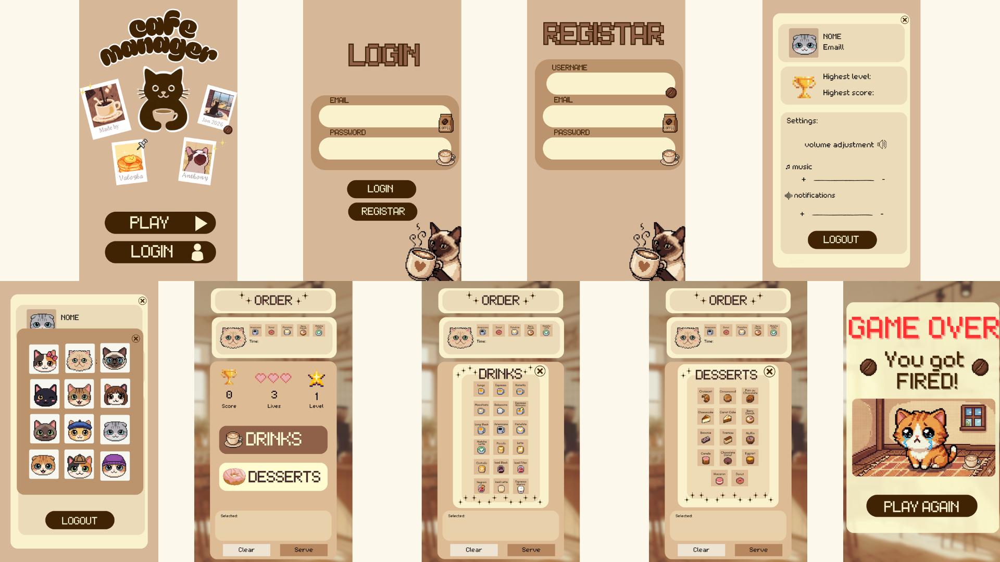

# CafeManager

**Disciplina:** Desenvolvimento de Jogos para Plataformas Móveis

**Autores:** Anthony Frade - Valezka Naia

## Introdução 

O **CafeManager** é jogo de simulação e gestão desenvolvido como projeto prático para a disciplina de Desenvolvimento de Jogos para Plataformas Móveis, tendo como principal objetivo a aplicação prática dos conhecimentos adquiridos ao longo da unidade curricular. O objetivo do jogo é colocar o utilizador no papel de um trabalhador de uma cafeteria, onde deve satisfazer os pedidos de diversos clientes (representados por gatos) dentro de um limite de tempo rigoroso

Este projeto visa aplicar conceitos fundmentais de desenvolvimento Android, como a construção de interfaces declarativas, gestão de estados complexos em tempo real e a implementação de mecânicas de jogo (pontuação, vidas e aumento de dificuldade) com a linguagem Kotlin e o framework Jetpack Compose

Para garantir uma arquitetura moderna e escalável, o projeto incorpora o **Firebase** como infraestrutura de backend, permitindo a autenticação de utilizadores e a persistência de dados na nuvem em tempo real. Além disso, utiliza o Dagger Hilt para a injeção de dependências, garantindo uma organização eficiente do código e simplificando a comunicação entre as diferentes camadas da aplicação

## Estrutura do Projeto 

O projeto foi desenvolvido seguindo o padrâo de arquitetura **MVVM (Model-View-ViewModel)**, promovendo a separação de responsibilidades e facilitando a manutenção do código

- **`app/`**
  - **`src/main/java/`**
    
    * **`MainActivity.kt`**: Ponto de acesso da aplicação e inicialização da interface gráfica
    * **`MyCafeManager.kt`**: configuração global da aplicação e navegação Compose
    * **`models/`**: Contém as classes de dados `GameItem`, `PlayerScore`, `UserProfile` para representar os itens disponíveis no café, a pontuação do jogador e armazenar os dados do utilizador autenticado
    * **`views/`**: Contém o `GameViewModel`, que gere o estado global, o tempo e a pontuação
    * **`login/`**: Funcionalidade de autenticação
    * **`ui/`**: Componentes de interface reutilizáveis (OrderSection, SelectionDialog, StatusRow, SelectedItemsArea) implementados com Jetpack Compose
    * **`repositories/`**: Abstração da fonte de dados, gerindo a comunicação com o **Firebase Firestore, Auth e DataStore**
    * **`utils/`**: Usado para gestão de ciclo de vida de áudio
    * **`profile/`**: Gestão de perfil do utilizador
    * **`navigation/`**: Gestão de rotas e navegação (`Routes`)
    * **`settings/`**: Responsável pela gestão das definições locais da aplicação
      
  - **`src/main/res/`**: Recursos da aplicação
    
    * **`drawable/`**: imagens e recursos gráficos
    * **`font/`**: Fonte usada na app
  
## Lista de Funcionalidades da Aplicação 
- **Geração de Pedidos:** sorteio aleatório de combinações de bebidas e doces

- **Sistema de Autenticação:** registo e login de utilizadores integrados com **Firebase Auth**
- **Cloud Data Storage:** Sincronização de recordes (High Scores) e perfis no **Firestore**
- **Sistema de Clientes Variados:** uso aleatório de 10 assets diferentes de gatos
- **Temporizador Reativo:** cronómetro de 30 segundos
- **Progressão de Dificuldade:** aumento do número de itens a cada 3 níveis que são ultrapassados
- **Sistema de Vidas:** gestão de 3 vidas com feedback visual (um efeito de transparência na imagem sempre que o jogador perde uma vida)
- **Menus de Seleção:** diálogos modais para escolha rápida entre 18 bebidas e 14 doces
- **Gestão de Áudio:** música de fundo em loop e efeitos sonoros para feedback de ações
- **Persistência Local:** armazenamento das definições de volume via Jetpack DataStore

## Esquemas e Protótipos da Aplicação 
Numa etapa inicial do desenvolvimento, foram estabelecidos esquemas e protótipos conceituais da aplicação, com o objetivo de planear a disposição dos elementos gráficos e a interação do utilizador com o sistema.

 

Estes protótipos serviram de base para a implementação final da interface gráfica

## Modelo de Dados
O modelo de dados utiliza uma `data class` para garantir a integridade dos itens do menu:

```kotlin
data class GameItem(
    val id: Int,
    val name: String,
    val type: ItemType,
    @DrawableRes val iconRes: Int
)

enum class ItemType { DRINK, DESSERT }
```
As pontuações são geridas pela classe `PlayerScore`, permitindo a criação de rankings futuros:
```kotlin
data class PlayerScore(
    var docId: String? = null,   // ID do documento no Firestore
    var userId: String? = null,  // UID do utilizador
    var playerName: String? = null, // Nome do jogador
    var score: Int = 0,          // Valor do score
)
```

## Implementação do Projeto 

A implementação do projeto foi realizada em Kotlin, recorrendo ao **Jetpack Compose** para a criação da interface gráfica e ao modelo de programação **MVVM** (Model-View-ViewModel) para a estruturação do código

A classe `MainActivity` é onde a aplicação começa, sendo responsável por carregar o ecrã principal através de componentes Compose. A interface gráfica é formada por diversos componentes, cada um com uma função específica, como a área de seleção de itens, a exibição do pedido atual e a demonstração do estado do jogo

A lógica de funcionamento da aplicação encontra-se centralizada no `GameViewModel`, que controla o estado geral do jogo. Este ViewModel mantém a lista de itens selecionados, executa as ações do utilizador e garante a consistência do fluxo do jogo. A utilização de estados observáveis permite que a interface se atualize automaticamente sempre que há uma mudança nos dados, sem necessidade de controlo manual da UI

O **Dagger Hilt** foi implementado como a solução de Injeção de Dependências, permitindo que instâncias globais, como os repositórios e os clientes do Firebase, sejam injetadas automaticamente nos ViewModels, eliminando a criação manual de objetos e facilitando a testabilidade. Paralelamente, o **Firebase** atua como a infraestrutura de backend; o **Firebase Authentication** gere o ciclo de vida de acesso dos utilizadores, enquanto o **Cloud Firestore** permite a persistência reativa de dados na nuvem. Esta combinação possibilita que o progresso do jogador e as suas credenciais sejam sincronizados em tempo real, utilizando flows assíncronos que mantêm a interface do jogo sempre atualizada com o estado mais recente do servidor

O modelo de dados é formado principalmente pela classe `GameItem`, uma data class que tem a função de representar os produtos disponíveis no café, incluindo bebidas e sobremesas. Esta classe é empregada pelo `GameViewModel` para gerir os pedidos realizados pelo utilizador e preservar o estado da aplicação. A classe `PlayerScore` foi criada para controlar o registro de desempenho dos jogadores, servindo como a conexão entre a sessão de jogo e a base de dados. Além de guardar a pontuação final e o nível alcançado, este modelo faz uso de identificadores únicos (userId) e marcas de tempo (timestamps) para assegurar a integridade das informações no **Firestore**

## Tecnologias Usadas 
- Kotlin
- Android Studio
- Jetpack Compose
- GitHub
- Firebase (Auth & Firestore)
- Dagger Hilt
- Jetpack DataStore
- Navigation Compose

## Dificuldades

Durante o desenvolvimento do projeto foram identificadas algumas dificuldades, nomeadamente:

* **Posicionamento de Elementos:** A aplicação de `offset` para posicionar os elementos sobre uma imagem de fundo fixa, de modo que se ajustassem aos locais predefinidos no protótipo, exigiu vários testes de proporção
* **Sincronização do Timer:** Resetar o `timerJob` corretamente ao mudar de nível ou ao perder uma vida para evitar bugs de contagem múltipla
* **Mapeamento de Erros:** converter exceções técnicas do **Firebase** para mensagens acessíveis para o utilizador através do `ResultWrapper`

## Conclusões 
A criação do projeto **CafeManager** permitiu a consolidação dos conhecimentos obtidos na disciplina, especialmente no que se refere ao desenvolvimento de jogos e aplicações para dispositivos móveis

O projeto representou um ponto significativo na compreensão do ecossistema Android. A utilização do **Jetpack Compose** demonstrou como a interface declarativa facilita o gerenciamento de estados complexos, algo essencial em ambientes de jogo onde diversos elementos (timer, score, animações) alteram-se ao mesmo tempo

A implementação do **Firebase** foi crucial para assegurar que as informações dos jogadores não permanecessem restritas ao dispositivos, oferecendo uma vivência de jogo contínua e segura na nuvem. Por sua vez, o **Dagger Hilt** facilitou a administração de dependências, possibilitando uma estrutura mais organizada e modular. Essas ferramentas, juntas, não apenas simplificaram o desenvolvimento atual, como também garantiram que a aplicação suporte diversos utilizadores e funcionalidades online de forma eficiente

Do ponto de vista técnico, a implementação da arquitetura **MVVM** possibilitou separar totalmente a lógica do jogo da camada de apresentação. Essa modularização não apenas tornou a depuração de falhas durante o desenvolvimento mais simples, mas também assegura que o projeto seja extremamente escalável, possibilitando a inclusão futura de novas mecânicas como power-ups
